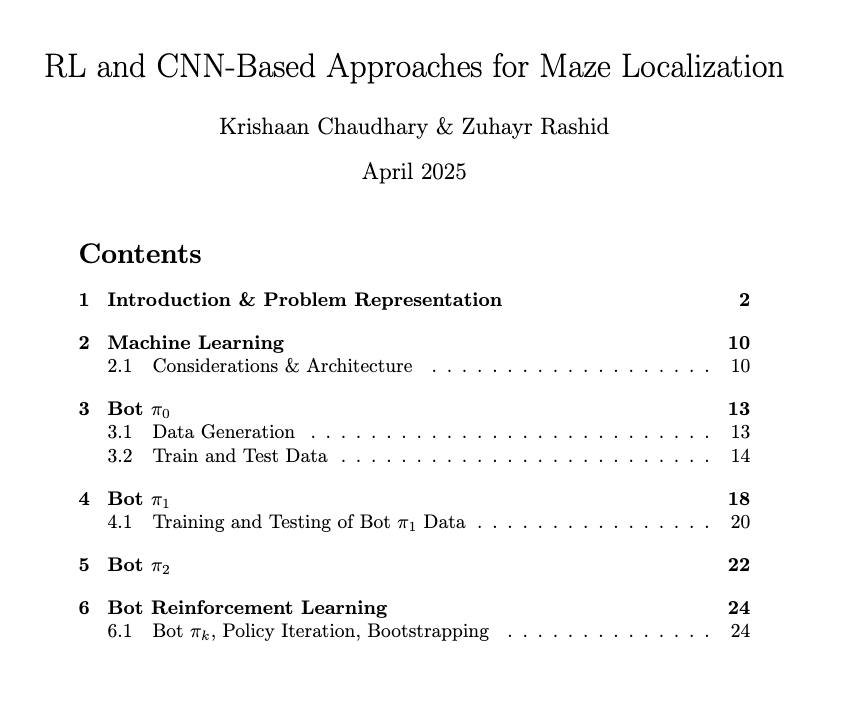

# RL and CNN-Based Approaches for Maze Localization

## Overview

This project focuses on designing and evaluating strategies for a bot to localize itself within a 30x30 grid maze. 
Starting with a set of possible locations (L) — all open cells — the bot reduces this set to a single location, by  moving around the maze. 
The project explores localization, graph search techniques, and machine learning approaches, including convolutional neural networks (CNNs) 
and reinforcement learning (RL) to predict the number of moves required for localization. 
Three bot strategies (π₀, π₁, π₂) and an iterative RL approach ($\pi_k$) are implemented and compared.

(how L, the set of all possible cells, changes with each move of the bot)

---

## Bot Strategies

### Bot π₀ (Baseline)
- **Approach**: Repeatedly plans paths to a predetermined target cell using a basic strategy until localization is achieved (|L| = 1).
- **Purpose**: Serves as the baseline for data generation and comparison with improved strategies.

### Bot π₁
- **Approach**:  
  Evaluates the best first move by predicting the expected number of moves (Ĉ*) for each possible direction (up, down, left, right) using a CNN trained on π₀ data.  
  Makes the optimal first move, then reverts to π₀.
- **Performance**: Shows improvement over π₀ for certain |L| ranges (50–250), but benefits are limited due to reverting to π₀.

### Bot π₂
- **Approach**:  
  Evaluates the best first move using a CNN trained on π₁ data.  
  Makes the optimal first move, then reverts to π₁.
- **Performance**: Outperforms π₀ for larger |L| (e.g., 500–549) and some mid-range |L| (50–200), but struggles with moderately sized (250–350) and small (0–49) |L|.

### Bot $\pi_k$ (Reinforcement Learning)
- **Approach**:  
  Starts with π₀ to generate initial data.  
  Trains a CNN ($Ĉ*_0$) to predict moves to localization, minimizing a Bellman-like loss.  
  Defines π₁ as a greedy policy based on $Ĉ*_0$.  
  Iteratively generates new data with the latest policy, trains a new model, and defines next policies (π₂, π₃, ..., $\pi_k$) until convergence.
- **Performance**: Shows incremental improvements, especially for |L| ranges of 50–200, 300–400, and 500+, reflecting realistic localization scenarios.

 
(Training and test loss for training on baseline strategy)

---

## Theoretical Analysis

- **Problem Representation**: The maze is a 30x30 grid with open cells (0), walls (1), and possible bot locations (-1). The bot reduces the set of possible locations (L) using moves and wall detections.

- **Key Questions Addressed**:
  - Number of possible L: \( $2^{|L_0|}$ \), where |L₀| is the number of open cells.
  - Updating L: Algorithm to update possible locations after a move based on wall presence.
  - Minimal Steps (C*): Recursive formulation for the minimal number of moves to localize, with base cases for |L| = 1 and specific |L| = 2 scenarios.
  - Graph Search: Represents states as nodes (sets L) and transitions as edges (moves). Uses A* with heuristic \( h(L) = |L| \).
  - Connection to C*: C* is the length of the shortest path found by A* from the initial L to any terminal node (|L| = 1).

---

## Machine Learning

- **Input Space**: \( $L \in \{-1, 0, 1\}^{30 \times 30}$ \), a 2D grid representing possible bot locations and maze structure.

- **Output Space**: Scalar \( $\hat{y} \in \mathbb{R}$ \), the predicted number of moves to localize.

- **Model**: CNN with convolutional layers (32, 64, 128 filters), ReLU activations, max pooling, dropout (0.5), and fully connected layers (256, 1).

- **Loss Function**: Mean Squared Error (MSE) for regression.

- **Training**: Adam optimizer, learning rate 0.001, 8 epochs.

---

## Data Generation

- Generated 150 samples for each |L| from 2 to total number of open cells.
- Balanced dataset by capping overrepresented buckets (275–350: 700 samples, 350–550: 500 samples).
- 80/20 train-test split, yielding ~8000 training and ~2000 test data points.

---

## Results

- Training and test losses decrease and level off by epochs 6–7.
- Model performs well for 200–500 moves but tends to overestimate for low/high move counts due to data distribution.

---

## Detailed Technical Report

[Paper: RL and CNN-Based Approaches for Maze Localization](RL_and_CNN-Based_Approaches_for_Maze_Localization.pdf)

